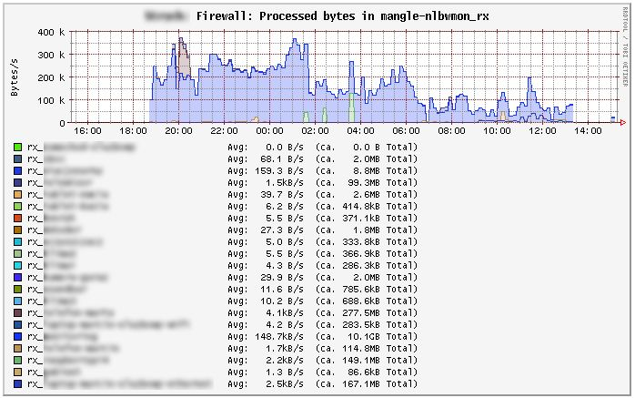
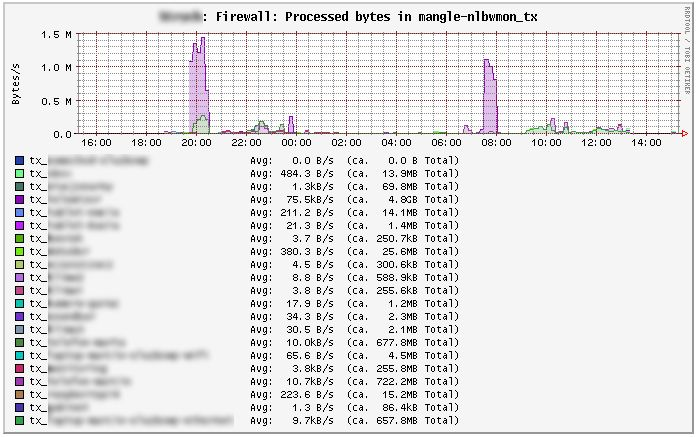
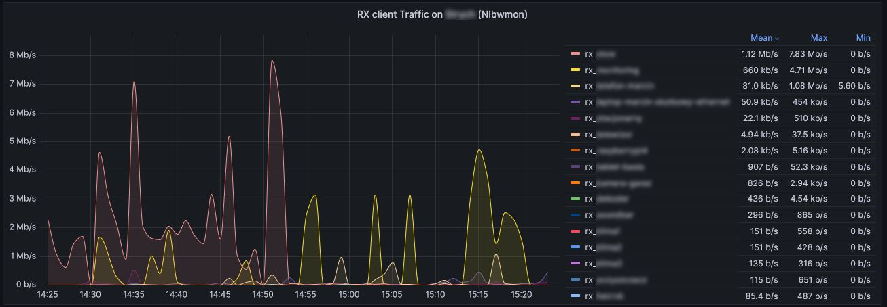
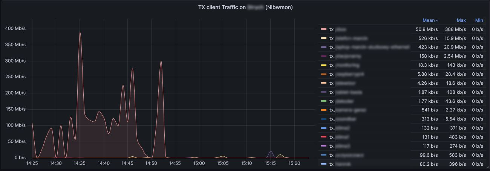
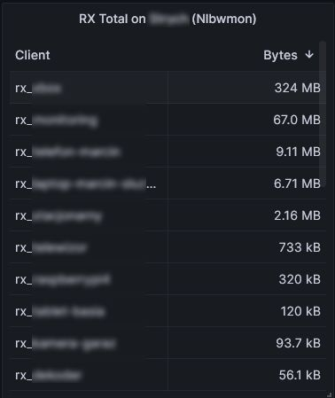
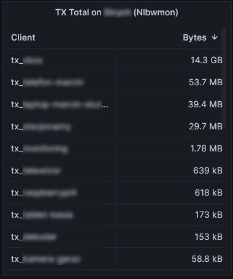

# nlbw2collectd
This collectd lua plugin allows you to put [Nlbwmon](https://github.com/jow-/nlbwmon) statistics directly to Collectd (luci-app-statistics). By default on Openwrt statistics are uploaded every 30 seconds, so it allows you to get pseudo realtime statistic about the traffic on your router.

# Why this plugin has been  created
I have been using [Iptmon](https://github.com/oofnikj/iptmon) tool to get very nice statistics of per host traffic on my Openwrt router. Unfortunatelly starting from Openwrt 22.03 release [Iptmon](https://github.com/oofnikj/iptmon) stopped to work due to replacement of iptables with nftables. When looking for alternatives I was not able to find anything what was close to Iptmon and working on latest Openwrt releases. I found [Nlbwmon](https://github.com/jow-/nlbwmon) to be very nice tool but what I was missing was more detailed per hour statistics with nice charts.

# Dependencies
This plugin assumes that you have Luci and luci-app-statistics installed. This plugin uses luci.jsonc lua library that should be bundled with Luci, if that is not the case you need to install this (details below). 
Another required library is collectd-mod-lua

# Limitation
Currently only IPv4 is supported, IPv6 support can be added later.
 
# Installation instructions.
1. Make sure that you have collectd-mod-lua installed on you openwrt router if not execute:
   ```
   opkg update
   opkg install collectd-mod-lua
   ```

2. Make sure that luci-lib-jsonc is installed:
   ```
   opkg list-installed | grep luci-lib-jsonc
   [...]
   luci-lib-jsonc - git-22.097.61937-bc85ba5
   ```
   If it is not installed install this with:
   ```
   opkg install luci-lib-jsonc
   ```
   
3. Copy [lua.conf]([lua.conf) to `collectd config` directory
   ```
   cp lua.conf /etc/collectd/conf.d
   ```
   
4. Copy [nlbw2collectd.lua](nlbw2collectd.lua) to `/usr/share/collectd-mod-lua/` directory
   ```
   cp nlbw2collectd.lua /usr/share/collectd-mod-lua/
   ```
5. Restart collectd
   ```
   /etc/init.d/collectd  restart
   ```
6. Login to luci and go to Statistics->Graphs->Firewall. After about minute you should see your statistics.

# Iptmon replacement
Starting from Openwrt 22.03 release [Iptmon](https://github.com/oofnikj/iptmon) stopped to work due to rpelacements of iptables with nftables. This plugin allows you to get the same set of statistics as Iptmon. To do this topu need to change two lines in the file nlbw2collectd.lua
In order to do this find lines below:
```
local PLUGIN_INSTANCE_RX="mangle-nlbwmon_rx" -- change to "mangle-iptmon_rx" to have full compliance with iptmon
local PLUGIN_INSTANCE_TX="mangle-nlbwmon_tx" -- change to "mangle-iptmon_tx" to have full compliance with iptmon
```
and change them to:
```
local PLUGIN_INSTANCE_RX="mangle-iptmon_rx" -- we have full compliance with iptmon
local PLUGIN_INSTANCE_TX="mangle-iptmon_tx" -- we have full compliance with iptmon
```

Make sure that Iptmon is not installed since this plugin and Iptmon can not coexist. 

# Example pictures





# Export to Influx DB and Grafana

By exporting data to external Influxdb/Grafana you can get more pleasant charts





   
   
