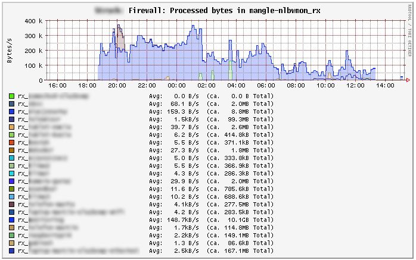
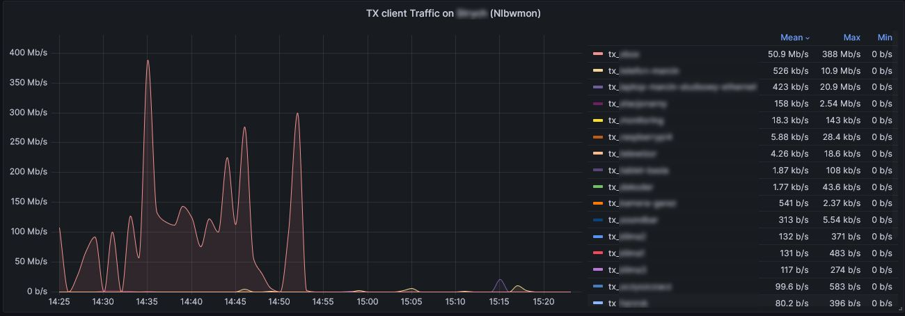
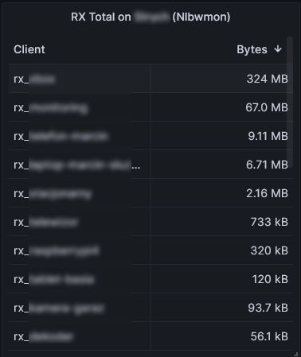
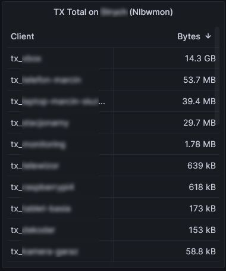

# nlbw2collectd
Nlbw2collectd jest pluginem Lua do Collectd który pozwala wrzucić statystyki [Nlbwmon](https://github.com/jow-/nlbwmon) do Collectd (moduł luci-app-statistics). Domyślnie statystyki sa aktualizowane co 30 sekund co pozwala otrzymac wykresy ruchu per host dla systemu Openwrt w czasie (prawie) rzeczywistym

# Dlaczego ten plugin został stworzony
Przez kilka lat używałem programu [Iptmon](https://github.com/oofnikj/iptmon) do analizy ruchu (per host) w mojej sieci. Niestety od wydania Openwrt 22.03 [Iptmon](https://github.com/oofnikj/iptmon) przestał działać ze wzgladu na zamiane Iptables na Nftables. Okazało sie jednak ze nie ma żadnej dobrej alternatywy dla [Iptmon](https://github.com/oofnikj/iptmon), dlatego wpadłem na pomysł eksportowania danych z [Nlbwmon](https://github.com/jow-/nlbwmon) do Collectd.

# Zależności
Dla poprawnego działania pluginy należy miec zainstalowane Luci i luci-app-statistics installed. Plugin używa biblioteki lua luci.jsonc która powinna byc automatycznie dostepna jeżeli mamy zainstalowane Luci, jeżeli tak nie jest trzeba ja doinstalować (szczegóły poniżej). 
Kolejną niezbedna biblioteką jest collectd-mod-lua

# Ograniczenia
Aktualnie wspierane jest tylko IPv4, wsparcie dla IPv6 może być dodane później
 
# Instrukcja instalacji
1. Sprawdź czy na Openwrt jest zainstalowane `collectd-mod-lua` jezeli nie to wykonujemy:
   ```
   opkg update
   opkg install collectd-mod-lua
   ```

2. Sprawdź czy na Openwrt jest zainstalowane  `luci-lib-jsonc` :
   ```
   opkg list-installed | grep luci-lib-jsonc
   [...]
   luci-lib-jsonc - git-22.097.61937-bc85ba5
   ```
   Jeżeli go nie ma to wykonujemy:
   ```
   opkg install luci-lib-jsonc
   ```
   
3. Kopiujemy [lua.conf](lua.conf) do `katalogu konfiguracyjnego collectd` 
   ```
   cp lua.conf /etc/collectd/conf.d
   ```
   
4. Kopiujemy [nlbw2collectd.lua](nlbw2collectd.lua) do katalogu `/usr/share/collectd-mod-lua/`
   ```
   cp nlbw2collectd.lua /usr/share/collectd-mod-lua/
   ```
5. Restartujemy Collectd
   ```
   /etc/init.d/collectd  restart
   ```
6. Logujemy się do Luci i sprawdzamy Statistics->Graphs->Firewall. Po około minucie powinny nam sie ukazac wykresy ruchu.

# Zamiennik dla Iptmon 
Od wydania Openwrt 22.03  [Iptmon](https://github.com/oofnikj/iptmon) przestał działać ze względu na zamianę iptables na nftables. Ten plugin pozwala na otrzymanie takiego samego zestawu statystyk jak Iptmon. Aby to sie stało należy zmienic dwie linie w pliku [nlbw2collectd.lua](nlbw2collectd.lua)
Zanjdujemy linijki poniżej:
```
local PLUGIN_INSTANCE_RX="mangle-nlbwmon_rx" -- change to "mangle-iptmon_rx" to have full compliance with iptmon
local PLUGIN_INSTANCE_TX="mangle-nlbwmon_tx" -- change to "mangle-iptmon_tx" to have full compliance with iptmon
```
i zamieniamy je na:
```
local PLUGIN_INSTANCE_RX="mangle-iptmon_rx" -- we have full compliance with iptmon
local PLUGIN_INSTANCE_TX="mangle-iptmon_tx" -- we have full compliance with iptmon
```

Upewniamy się że Iptmon nie jest zainstalowany ponieważ po tej zmianie Iptmon i ten plugin nie mogą być zainstalowane jednoczesnie.

# Przykładowe wykresy




# Eksport statystyk do Influx DB i Grafany

Statystyki mozna wyeksportować do Influxdb/Grafany dzięki czemu można uzyskać znacznie lepsze wykresy. Instrukcje mozna znaleźć na [Github](https://github.com/mstojek/gociwd)






   
   
